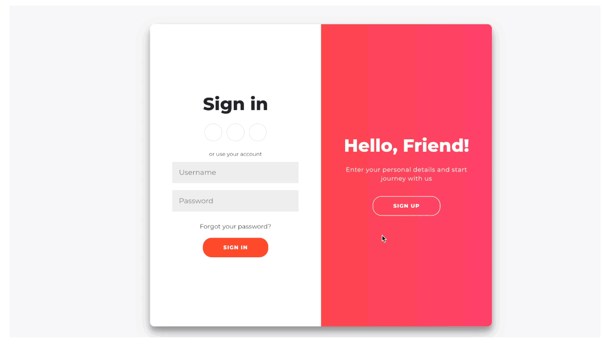
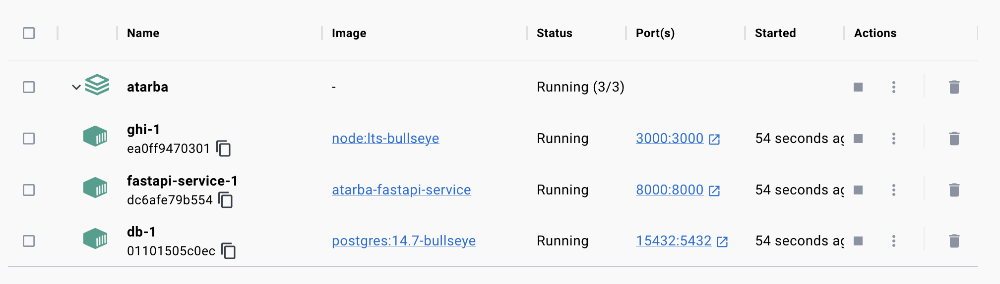
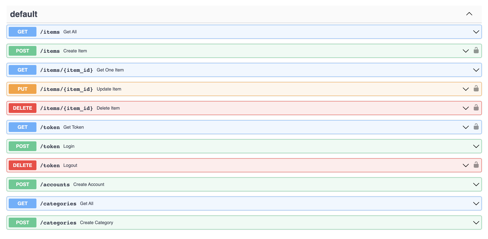

# AtArba

AtArba is a web application for individuals who are interested in selling and purchasing auto parts.

## Key Features - MVP(Minimum Viable Product)

1. Users are able to sign-up for an account, log-in, and log-out.
2. Users can view items but need to logged in in order to sell.
3. Users can purchase without log in, but need to fill out information while checking out which also creates an account.
4. After login, user can put item into the cart, so they can be able to check it later.

#### Further
* After an item is sold, what happens? Should I create a **states table** for items, can be used
as a foreign key? 

## Live Demo

##  Docker Containers (Services)
* ghi-1 (Graphic User Interface): Frontend built with React
* fastapi-service-1: Backend built with Fast API
* db-1 (Database): PostgreSQL

## API Endpoints (Fast API)
local url: http://localhost:8000/docs

## Installation

1. Fork repository
2. Clone repository to local: git clone https://gitlab.com/
3. cd into new project directory
4. Run: docker volume create postgres-data
5. Run docker volume create pg-admin
6. Run: docker compose build
7. Run: docker compose up

Access the application on your web browser at http://localhost:3000/
Access the FastAPI Swagger UI at http://localhost:8010/docs

## Requirements

1. Python 3
2. Docker Desktop
3. VS Code
4. FastAPI
5. A database compatible with PostgreSQL databases

## Maintainers
* @kaharerbol

## Install Extensions

* Prettier: <https://marketplace.visualstudio.com/items?itemName=esbenp.prettier-vscode>
* Black Formatter: <https://marketplace.visualstudio.com/items?itemName=ms-python.black-formatter>

